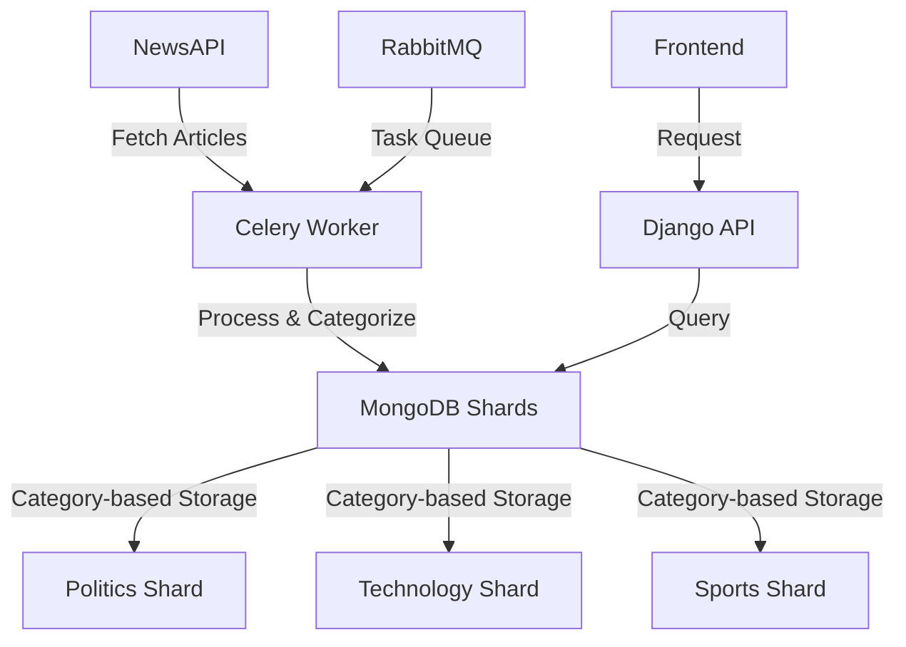

# 📰 News Aggregator Platform

<div align="center">


*A scalable Django-based news aggregation platform with real-time article fetching and intelligent categorization*

</div>

---

## 📋 **Description**

A robust Django-based platform that aggregates news articles from various sources using the NewsAPI. The system intelligently fetches articles across different categories and stores them in MongoDB with category-based sharding for optimal performance. Built with asynchronous task processing using **Celery** and **RabbitMQ**, the entire platform is containerized with **Docker** for seamless deployment and scalability.

---

## 🚀 **Features**

| Feature | Description |
|---------|-------------|
| 📡 **Real-time News Fetching** | Continuously fetches the latest news from NewsAPI across multiple sources |
| 🗂️ **Intelligent Sharding** | Stores articles in MongoDB with category-based sharding for optimal performance |
| ⚡ **Asynchronous Processing** | Uses Celery workers with RabbitMQ for efficient background task handling |
| 🐳 **Fully Dockerized** | Complete containerization for easy deployment and environment consistency |
| 🏷️ **Category Management** | Organized article storage and retrieval by news categories |
| 📊 **Scalable Architecture** | Built to handle high-volume news aggregation with horizontal scaling |

---

## 🔧 **Tech Stack**

<div align="center">

| Technology | Version | Purpose |
|------------|---------|---------|
| 🐍 **Python** | 3.10 | Core programming language |
| 🎯 **Django** | Latest | Web framework and API |
| 🌾 **Celery** | Latest | Asynchronous task processing |
| 🐰 **RabbitMQ** | Latest | Message broker |
| 🍃 **MongoDB** | Latest | NoSQL database with sharding |
| 🐳 **Docker** | Latest | Containerization platform |

</div>

---

## 🛠️ **Setup Instructions**

### **1. Clone the Repository**
```bash
git clone https://github.com/yourusername/news-aggregator.git
cd news-aggregator
```

### **2. Environment Configuration**
Create a `.env` file in the root directory:
```env
# NewsAPI Configuration
NEWS_API_KEY=your_newsapi_key_here

# MongoDB Configuration
MONGO_URI=mongodb://localhost:27017/
MONGO_DB_NAME=news_aggregator

# RabbitMQ Configuration
CELERY_BROKER_URL=pyamqp://guest@localhost//

# Django Configuration
DEBUG=True
SECRET_KEY=your_secret_key_here
```

### **3. Build and Launch**
```bash
# Build and start all services
docker-compose up --build

# Run in detached mode
docker-compose up --build -d
```

### **4. Access the Application**
| Service | URL | Credentials |
|---------|-----|-------------|
| 🌐 **Web Application** | http://localhost:8000 | - |
| 📊 **RabbitMQ Dashboard** | http://localhost:15672 | `guest` / `guest` |
| 🗄️ **MongoDB** | localhost:27017 | - |

---

## 📂 **Project Structure**

```
news-aggregator/
├── 📁 news_aggregator/          # Main Django project
│   ├── settings.py             # Django configuration
│   ├── urls.py                # URL routing
│   └── wsgi.py               # WSGI application
├── 📁 aggregator/              # Core Django app
│   ├── models.py             # Data models
│   ├── views.py              # API views
│   ├── serializers.py        # DRF serializers
│   └── urls.py              # App URLs
├── 📁 tasks/                   # Celery task definitions
│   ├── news_tasks.py         # News fetching tasks
│   └── celery_app.py        # Celery configuration
├── 📁 utils/                   # Utility modules
│   ├── news_fetcher.py       # NewsAPI integration
│   ├── mongo_client.py       # MongoDB operations
│   └── sharding.py          # Database sharding logic
├── 🐳 Dockerfile              # Container definition
├── 🐳 docker-compose.yml      # Multi-container setup
├── 📋 requirements.txt        # Python dependencies
├── 🔐 .env                    # Environment variables
├── 🚫 .gitignore             # Git ignore rules
└── 📖 README.md              # Project documentation
```

---

## 🔄 **Workflow**



---

## 🚀 **Quick Start Commands**

```bash
# Start all services
docker-compose up -d

# View logs
docker-compose logs -f

# Stop all services
docker-compose down

# Rebuild containers
docker-compose up --build --force-recreate

# Access Django shell
docker-compose exec web python manage.py shell

# Run migrations
docker-compose exec web python manage.py migrate

# Create superuser
docker-compose exec web python manage.py createsuperuser
```

---

## 📊 **API Endpoints**

| Endpoint | Method | Description |
|----------|--------|-------------|
| `/api/articles/` | GET | Retrieve all articles |
| `/api/articles/category/<str:category>/` | GET | Get articles by category |
| `/api/fetch-news/` | POST | Trigger manual news fetch |
| `/api/health/` | GET | Health check endpoint |

---

## 🛡️ **Environment Variables**

| Variable | Description | Required | Default |
|----------|-------------|----------|---------|
| `NEWS_API_KEY` | Your NewsAPI key | ✅ Yes | - |
| `MONGO_URI` | MongoDB connection string | ❌ No | `mongodb://localhost:27017/` |
| `CELERY_BROKER_URL` | RabbitMQ broker URL | ❌ No | `pyamqp://guest@localhost//` |
| `DEBUG` | Django debug mode | ❌ No | `False` |

---

## 🤝 **Contributing**

1. Fork the repository
2. Create a feature branch (`git checkout -b feature/amazing-feature`)
3. Commit your changes (`git commit -m 'Add amazing feature'`)
4. Push to the branch (`git push origin feature/amazing-feature`)
5. Open a Pull Request

---

## 📄 **License**

This project is licensed under the MIT License - see the [LICENSE](LICENSE) file for details.

---

## 📞 **Support**

If you encounter any issues or have questions:

- 🐛 **Issues**: [GitHub Issues](https://github.com/dhruvsh1997/NewsAggrigationAPP_NoSQL_Sharding/issues)
- 📧 **Email**: dhruvsh1997@gmail.com
- 💬 **Discussions**: [GitHub Discussions](https://github.com/dhruvsh1997/NewsAggrigationAPP_NoSQL_Sharding/discussions)

---

<div align="center">

**⭐ If you found this project helpful, please give it a star! ⭐**

Made with ❤️ by [Dhruv Sharma](https://github.com/dhruvsh1997)

</div>
